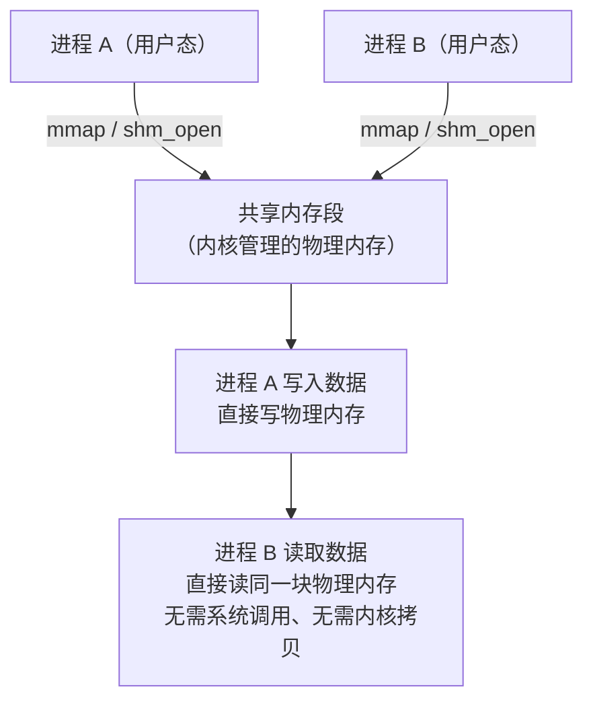
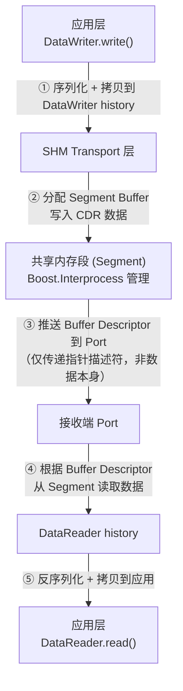
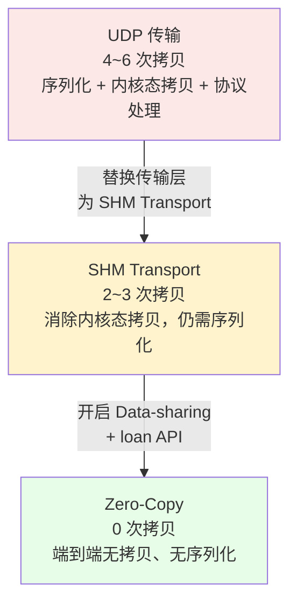
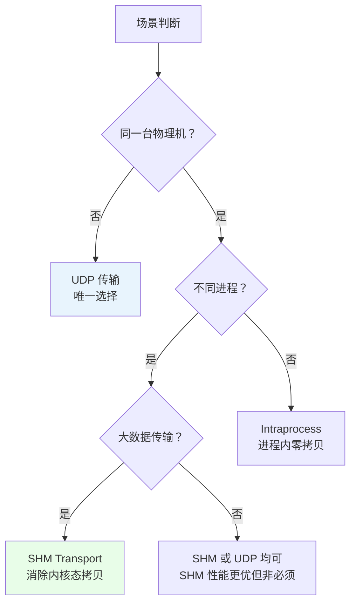

Fast DDS 的分层结构中，传输层是两个进程之间通信的桥梁。Fast DDS 默认支持多种传输方式：


| 标识符                   | 值   | 传输类型                                                                                                                                          |
| --------------------- | --- | --------------------------------------------------------------------------------------------------------------------------------------------- |
| LOCATOR_KIND_RESERVED | 0   | 保留给内部使用                                                                                                                                       |
| LOCATOR_KIND_UDPv4    | 1   | [UDP 传输（IPv4）](https://fast-dds.docs.eprosima.com/en/latest/fastdds/transport/udp/udp.html#transport-udp-udp)                                 |
| LOCATOR_KIND_UDPv6    | 2   | [UDP 传输（IPv6）](https://fast-dds.docs.eprosima.com/en/latest/fastdds/transport/udp/udp.html#transport-udp-udp)                                 |
| LOCATOR_KIND_TCPv4    | 4   | [TCP 传输（IPv4）](https://fast-dds.docs.eprosima.com/en/latest/fastdds/transport/tcp/tcp.html#transport-tcp-tcp)                                 |
| LOCATOR_KIND_TCPv6    | 8   | [TCP 传输（IPv6）](https://fast-dds.docs.eprosima.com/en/latest/fastdds/transport/tcp/tcp.html#transport-tcp-tcp)                                 |
| LOCATOR_KIND_SHM      | 16  | [共享内存传输](https://fast-dds.docs.eprosima.com/en/latest/fastdds/transport/shared_memory/shared_memory.html#transport-sharedmemory-sharedmemory) |


当本地进程间需要传输大数据（点云、图像）时，UDP 传输的 4~6 次内存拷贝会成为严重的性能瓶颈。**Shared Memory Transport（SHM）** 通过操作系统提供的共享内存机制替代网络传输，消除了内核态拷贝和系统调用，将传输层的开销大幅降低。但需要注意，SHM Transport 本身并不等于"零拷贝"——要实现端到端的零拷贝，还需要结合 **Data-sharing delivery** 和 **loan API**。

### 文档导航


| 章节                                         | 内容                                                                 | 适合谁看             |
| ------------------------------------------ | ------------------------------------------------------------------ | ---------------- |
| [1. 实现原理](#1-共享内存传输的实现原理)                  | OS 层机制 → Fast DDS 架构 → Segment/Port/BufferDescriptor → 与 UDP 数据流对比 | 理解 SHM 底层原理、面试准备 |
| [2. 具体使用](#2-如何使用-shared-memory-transport) | XML/C++ 配置、SHM+UDP 混合模式、关键参数                                       | 实际项目接入           |
| [3. 性能对比](#3-性能对比shm-vs-udp)               | 拷贝次数、延迟、吞吐量实测数据                                                    | 选型决策、性能论证        |
| [4. 优缺点与场景](#4-优缺点与适用场景)                   | 优点/缺点/适用场景推荐度                                                      | 选型决策             |
| [5. 面试常见问题](#5-面试常见问题)                     | 10 个高频问题与深度解答                                                      | 面试准备             |
| [6. 总结](#6-总结)                             | 核心要点速查                                                             | 快速回顾             |


---

## 1. 共享内存传输的实现原理

理解 SHM 传输需要从两个层面入手：**操作系统层面**（共享内存是怎么来的）和 **Fast DDS 层面**（DDS 中间件如何利用共享内存传数据）。

### 1.1 操作系统层面的共享内存

共享内存是 POSIX IPC（进程间通信）中**效率最高**的方式——多个进程直接映射同一块物理内存到自己的虚拟地址空间，无需任何内核数据搬运：





**核心机制**：


| 概念             | 说明                                                      |
| -------------- | ------------------------------------------------------- |
| **shm_open()** | 创建/打开一个命名共享内存对象（POSIX 标准）                               |
| **mmap()**     | 将共享内存对象映射到进程的虚拟地址空间                                     |
| **零拷贝**        | 数据写入后，其他进程直接通过指针读取，无需 `copy_from_user` / `copy_to_user` |
| **同步机制**       | 多进程访问同一内存需要互斥锁（mutex）或信号量（semaphore）防止竞争                |


与 UDP 传输的本质区别：UDP 必须经过 `用户态 → 内核态 → 网络 → 内核态 → 用户态` 的完整路径；SHM 直接在用户态完成，**不经过内核协议栈**。

### 1.2 Fast DDS SHM 传输架构

Fast DDS 的 SHM 传输基于 **Boost.Interprocess** 库实现，核心组件如下：





关键组件说明（参考官方文档 Definition of Concepts）：


| 组件                    | 职责                                                                                        |
| --------------------- | ----------------------------------------------------------------------------------------- |
| **Segment**           | 一块命名共享内存区域（由 `segment_size` 控制大小）。每个 DomainParticipant 创建自己的 Segment                      |
| **Segment Buffer**    | Segment 中分配的缓冲区，存放一条 DDS 消息的 CDR 数据                                                       |
| **Buffer Descriptor** | 指向 Segment Buffer 的"指针描述符"（含 segmentId + offset）。SHM Transport 在进程间传递的是 Descriptor，而非数据本身 |
| **Port**              | 逻辑通信通道（ring-buffer 实现），用于传递 Buffer Descriptor。每个 Participant 创建一个接收 Port                  |
| **通知机制**              | 基于条件变量（condition variable）的零轮询通知，接收端不忙等                                                   |


> **关键理解**：SHM Transport 在传输层用共享内存替代了网络，但数据仍然需要从应用拷贝到 DataWriter history（含序列化），再从 DataReader history 拷贝到应用（含反序列化）。SHM Transport 消除的是**传输层**的拷贝（即 UDP 中 sendto/recvfrom 的内核态拷贝），而非应用层与 DDS 中间件之间的拷贝。

### 1.3 数据流对比：SHM vs UDP

将 SHM 的数据流与 UDP 对比，可以直观看出为什么 SHM 性能远超 UDP：

**UDP 传输路径（4~6 次拷贝）**：


**SHM Transport 传输路径（2~3 次拷贝）**：


| 维度   | UDP                            | SHM Transport      | SHM + Data-sharing + Zero-Copy |
| ---- | ------------------------------ | ------------------ | ------------------------------ |
| 内存拷贝 | 4~6 次                          | 2~3 次（消除内核态拷贝）     | 0~1 次（端到端零拷贝）                  |
| 系统调用 | sendto/recvfrom（每次触发上下文切换）     | 无（纯用户态操作）          | 无                              |
| 序列化  | CDR 编解码（遍历全部数据）                | 仍需 CDR 序列化         | 可跳过（loan API 直接写共享内存）          |
| 协议头  | RTPS + UDP + IP + ETH（约 98 字节） | RTPS + SHM 元数据     | 无 RTPS 封装                      |
| 同步   | 网络传输，无需进程间同步                   | 需要 mutex/semaphore | 需要 mutex/semaphore             |


### 1.4 SHM Transport / Data-sharing / Zero-Copy 三者关系

Fast DDS 中有三个不同层次的"共享内存"机制，**它们不是同一个东西**：


| 概念                          | 官方文档      | 层次                      | 本质                                                                                         |
| --------------------------- | --------- | ----------------------- | ------------------------------------------------------------------------------------------ |
| **Shared Memory Transport** | 6.4 传输层   | 传输层                     | 一种传输方式（类似 UDP/TCP），用共享内存替代网络。数据仍需从应用拷贝到 DataWriter history，再从 DataReader history 拷贝到应用     |
| **Data-sharing delivery**   | 6.5 QoS 层 | DataWriter ↔ DataReader | 直接共享 DataWriter 的 history 给 DataReader，消除了 history ↔ 传输层之间的拷贝。通过 `DataSharingQosPolicy` 配置 |
| **Zero-Copy communication** | 15.9 应用层  | 应用 ↔ 应用                 | 结合 Data-sharing + `loan_sample()` / `return_loan()` API，应用直接写/读共享内存，实现端到端 0 次拷贝            |


三者是**递进关系**：





> **面试高频点**：很多人说"SHM Transport = 零拷贝"，这是不准确的。SHM Transport 只是消除了传输层的内核态拷贝，应用与 DataWriter/DataReader history 之间仍有拷贝。真正的端到端零拷贝需要 Data-sharing delivery + loan API 的配合。详见 [Zero-Copy communication](./Zero-Copy%20communication.md)。

### 1.5 发现机制：SHM 与 UDP 的关系

SHM 只能用于同一台机器上的进程间通信，**无法替代 UDP 的组播发现功能**。Fast DDS 的典型做法是 **SHM + UDP 同时注册**：


| 功能         | 使用的传输  | 原因                          |
| ---------- | ------ | --------------------------- |
| **参与者发现**  | UDP 组播 | SHM 不支持组播，发现必须走 UDP         |
| **本地数据通信** | SHM 优先 | 同一台机器上的 Participant 自动走 SHM |
| **远程数据通信** | UDP    | 跨机器只能走 UDP                  |


Fast DDS 在发现阶段通过 UDP 组播交换 Locator 信息。当发现对方也在同一台机器上时，会自动切换到 SHM 传输数据，无需用户干预。

---

## 2. 如何使用 Shared Memory Transport

### 2.1 默认行为

Fast DDS **默认启用 SHM 传输**。如果你没有做任何自定义配置，Fast DDS 会自动注册 SHM + UDP 两种传输：

- 本地通信 → 自动走 SHM
- 远程通信 → 自动走 UDP

> 大多数情况下，你不需要额外配置 SHM。只有当你需要调优 SHM 参数或禁用 SHM 时，才需要显式配置。

### 2.2 XML 配置

```xml
<!-- 示例 1：仅使用 SHM 传输（禁用 UDP，仅限本地通信） -->
<profiles>
    <participant profile_name="shm_only" is_default_profile="true">
        <rtps>
            <userTransports>
                <transport_id>shm_transport</transport_id>
            </userTransports>
            <useBuiltinTransports>false</useBuiltinTransports>
        </rtps>
    </participant>
</profiles>

<library_settings>
    <intraprocess_delivery>FULL</intraprocess_delivery>
</library_settings>

<!-- SHM 传输描述符 -->
<transport_descriptors>
    <transport_descriptor>
        <transport_id>shm_transport</transport_id>
        <type>SHM</type>
        <segment_size>104857600</segment_size>          <!-- 100 MB 共享内存段 -->
        <port_queue_capacity>1024</port_queue_capacity>  <!-- 端口队列深度 -->
        <healthy_check_timeout_ms>1000</healthy_check_timeout_ms>
        <rtps_dump_file>shm_dump.log</rtps_dump_file>    <!-- 调试用，生产环境关闭 -->
    </transport_descriptor>
</transport_descriptors>
```

```xml
<!-- 示例 2：SHM + UDP 混合模式（推荐，本地走 SHM，远程走 UDP） -->
<transport_descriptors>
    <!-- SHM 传输 -->
    <transport_descriptor>
        <transport_id>shm_transport</transport_id>
        <type>SHM</type>
        <segment_size>104857600</segment_size>
    </transport_descriptor>

    <!-- UDP 传输（用于发现和远程通信） -->
    <transport_descriptor>
        <transport_id>udp_transport</transport_id>
        <type>UDPv4</type>
        <sendBufferSize>4194304</sendBufferSize>
        <receiveBufferSize>4194304</receiveBufferSize>
    </transport_descriptor>
</transport_descriptors>

<profiles>
    <participant profile_name="shm_udp_hybrid" is_default_profile="true">
        <rtps>
            <userTransports>
                <transport_id>shm_transport</transport_id>
                <transport_id>udp_transport</transport_id>
            </userTransports>
            <useBuiltinTransports>false</useBuiltinTransports>
        </rtps>
    </participant>
</profiles>
```

### 2.3 C++ API 配置

```cpp
#include <fastdds/rtps/transport/shared_memory/SharedMemTransportDescriptor.h>
#include <fastdds/rtps/transport/UDPv4TransportDescriptor.h>

using namespace eprosima::fastdds::rtps;

// 1. 配置 SHM 传输
auto shm_transport = std::make_shared<SharedMemTransportDescriptor>();
shm_transport->segment_size = 100 * 1024 * 1024;       // 100 MB 共享内存段
shm_transport->port_queue_capacity = 1024;              // 端口队列深度
shm_transport->healthy_check_timeout_ms = 1000;         // 健康检查超时

// 2. 配置 UDP 传输（用于发现和远程通信）
auto udp_transport = std::make_shared<UDPv4TransportDescriptor>();
udp_transport->sendBufferSize = 4 * 1024 * 1024;
udp_transport->receiveBufferSize = 4 * 1024 * 1024;

// 3. 注册传输
DomainParticipantQos pqos;
pqos.transport().use_builtin_transports = false;        // 禁用默认传输

TransportDescriptorList transports;
transports.push_back(shm_transport);                    // SHM 优先
transports.push_back(udp_transport);                    // UDP 兜底
pqos.transport().user_transports = transports;

// 4. 创建 Participant
DomainParticipant* participant =
    DomainParticipantFactory::get_instance()->create_participant(0, pqos);
```

### 2.4 关键参数说明


| 参数                         | 默认值           | 建议值（大数据场景）        | 说明                             |
| -------------------------- | ------------- | ----------------- | ------------------------------ |
| `segment_size`             | 约 64 MB（平台相关） | 100~512 MB        | 共享内存段的总大小，必须大于所有待发送消息的总和       |
| `port_queue_capacity`      | 512           | 1024~4096         | 每个逻辑端口的消息队列深度，高吞吐时增大           |
| `max_message_size`         | 无硬限制          | 与 segment_size 协调 | 单条消息的最大大小                      |
| `healthy_check_timeout_ms` | 1000          | 1000~5000         | 共享段健康检查超时，超时后触发恢复              |
| `remove_on_destroy`        | true          | 视场景而定             | 进程退出时是否删除共享段。设为 false 可保留数据供调试 |


> **segment_size 的选择原则**：`segment_size` 必须大于同一时刻驻留在共享内存中的所有消息的总大小。以 2 MB 点云、10 Hz 为例，如果接收端能在 100ms 内处理完一帧，则共享段中最多同时存在 1~~2 帧，segment_size 至少需要 4~~8 MB。建议留 2~~4 倍余量，设为 32~~64 MB。

---

## 3. 性能对比：SHM vs UDP

### 3.1 核心指标对比


| 维度         | UDP 传输                    | SHM 传输                  | 提升幅度       |
| ---------- | ------------------------- | ----------------------- | ---------- |
| **内存拷贝次数** | 4~6 次                     | 2~3 次（消除内核态拷贝）          | 降低 40%~50% |
| **系统调用**   | 每包 2 次（sendto + recvfrom） | 0 次                     | 完全消除       |
| **序列化开销**  | CDR 编解码（全量遍历）             | 仍需 CDR 序列化              | 无变化（仍需序列化） |
| **协议头开销**  | 约 98 字节/包                 | RTPS + SHM 元数据（约 40 字节） | 降低约 60%    |
| **延迟**     | 微秒级（受内核调度影响）              | 亚微秒级                    | 降低 50%~80% |
| **CPU 占用** | 高（大数据时 60%+）              | 较低（通常 15%~30%）          | 降低 50%+    |
| **吞吐量**    | 受限于网络带宽和 CPU              | 受限于内存带宽                 | 显著提升       |


> **注意**：上表是仅使用 SHM Transport（未开启 Data-sharing / Zero-Copy）的数据。如果进一步开启 Data-sharing + loan API（即 Zero-Copy 模式），拷贝次数可降至 0 次，序列化也可跳过，CPU 占用可降至 5% 以下。详见 [Zero-Copy communication](./Zero-Copy%20communication.md)。

### 3.2 实测数据参考

以 128 线激光雷达点云（2 MB/帧，10 Hz）为例：


| 指标     | UDP 传输                      | SHM Transport                   | SHM + Zero-Copy |
| ------ | --------------------------- | ------------------------------- | --------------- |
| 实际帧率   | 3~~4 Hz（未调优） / 7~~8 Hz（调优后） | 10 Hz+（满帧率）                     | 10 Hz+（满帧率）     |
| CPU 占用 | 60%+（未调优） / 35%（调优后）        | 15%~30%                         | 3%~5%           |
| 端到端延迟  | 2~5 ms                      | 0.5~1 ms                        | 0.1~0.5 ms      |
| 内存拷贝量  | 12 MB/帧 × 10 Hz = 120 MB/s  | 4~~6 MB/帧 × 10 Hz = 40~~60 MB/s | 0 MB/s（指针传递）    |


> **结论**：对于本地大数据传输，SHM Transport 已经能显著提升性能（消除内核态拷贝和系统调用）。如果进一步开启 Zero-Copy（Data-sharing + loan API），可以将 CPU 占用降至最低。UDP 即使经过充分调优，在 2 MB 级别消息场景下也很难达到满帧率。

---

## 4. 优缺点与适用场景

### 4.1 优点


| 优点           | 说明                                                                              |
| ------------ | ------------------------------------------------------------------------------- |
| **消除内核态拷贝**  | 数据通过共享内存传递，不经过内核协议栈，拷贝次数从 4~~6 次降到 2~~3 次。配合 Data-sharing + loan API 可进一步降至 0 次 |
| **无系统调用**    | 纯用户态操作，不经过内核协议栈，无上下文切换开销                                                        |
| **CPU 占用较低** | 消除了内核态拷贝和系统调用，大数据场景下 CPU 占用约 15%~30%（配合 Zero-Copy 可降至 5% 以下）                    |
| **延迟极低**     | 亚毫秒级延迟，无网络传输和内核调度的不确定性                                                          |
| **无协议头开销**   | 不需要 UDP/IP/以太网头部，带宽利用率接近 100%                                                   |
| **无 MTU 限制** | 不受网络 MTU 约束，无需分片/重组                                                             |
| **无丢包问题**    | 共享内存不存在网络丢包，无需重传机制                                                              |


### 4.2 缺点


| 缺点            | 说明                                      |
| ------------- | --------------------------------------- |
| **仅限同一台机器**   | 无法跨网络传输，不同物理机之间不能使用 SHM                 |
| **不支持组播发现**   | 参与者发现仍需 UDP 组播，SHM 不能完全替代 UDP           |
| **共享内存段大小有限** | segment_size 受物理内存限制，不能无限增大             |
| **需要同步机制**    | 多进程访问同一内存需要 mutex/semaphore，实现复杂度高于 UDP |
| **进程生命周期耦合**  | 共享段需要在所有进程退出后清理，异常退出可能导致资源泄漏            |
| **调试困难**      | 共享内存不像网络包可以用 tcpdump/Wireshark 抓包分析     |
| **平台差异**      | POSIX shm 和 Windows 共享内存的实现细节不同，跨平台需注意  |


### 4.3 适用场景


| 场景             | 推荐度   | 说明                                 |
| -------------- | ----- | ---------------------------------- |
| 本地大数据传输（点云、图像） | ⭐⭐⭐⭐⭐ | SHM 的最佳场景，配合 Zero-Copy 可进一步消除序列化开销 |
| 本地高频小消息通信      | ⭐⭐⭐⭐  | 性能优异，但如果 UDP 已满足需求，SHM 优势不明显       |
| 本地多进程流水线       | ⭐⭐⭐⭐⭐ | 如感知→规划→控制流水线，进程间大数据传递              |
| 跨机器通信          | 不支持   | SHM 仅限同一台物理机                       |
| 需要组播发现的场景      | ⭐⭐⭐   | SHM 本身不支持发现，需配合 UDP                |
| 嵌入式/内存受限环境     | ⭐⭐    | 共享内存段占用物理内存，内存紧张时需谨慎               |


---

## 5. 面试常见问题

### Q1：共享内存为什么快？

**答**：SHM Transport 快在两个层面：

1. **消除内核态拷贝**：UDP 必须经过 `sendto()`（用户态→内核态）和 `recvfrom()`（内核态→用户态），SHM 全程在用户态完成，无上下文切换开销。
2. **无协议开销**：不需要 UDP/IP/以太网头部封装（约 98 字节），不需要分片/重组，不需要校验和计算。

但 SHM Transport 仍有 2~3 次拷贝（应用↔DataWriter/DataReader history 的序列化/反序列化拷贝）。如果要进一步消除这些拷贝，需要开启 Data-sharing + loan API（即 Zero-Copy 模式）。

### Q2：SHM Transport 和 Zero-Copy 是什么关系？

**答**：它们不是同一个东西，是递进关系：

- **SHM Transport**：传输层机制，用共享内存替代网络传输，消除内核态拷贝。但应用↔DataWriter/DataReader history 之间仍有 2~3 次拷贝。
- **Data-sharing delivery**：QoS 层机制，直接共享 DataWriter 的 history 给 DataReader，消除 history ↔ 传输层的拷贝。
- **Zero-Copy**：应用层机制，结合 Data-sharing + `loan_sample()` / `return_loan()` API，应用直接写/读共享内存，实现端到端 0 次拷贝。

三者关系：UDP → SHM Transport（消除内核态拷贝）→ Zero-Copy（消除所有拷贝）。

### Q3：SHM 能完全替代 UDP 吗？

**答**：不能。原因：

1. SHM 仅限同一台物理机上的进程间通信，无法跨网络。
2. SHM 不支持组播，而 Fast DDS 的参与者发现（SPDP）依赖 UDP 组播。
3. 实际项目中通常 **SHM + UDP 混合使用**：发现走 UDP 组播，本地数据走 SHM，远程数据走 UDP。

### Q4：共享内存的 segment_size 怎么设置？

**答**：`segment_size` 必须大于同一时刻驻留在共享内存中的所有消息的总大小。计算方法：

```
最小 segment_size = 单条消息最大大小 × 同时驻留的消息数 × 安全余量
```

以 2 MB 点云、10 Hz 为例：如果接收端能在 100ms 内处理完一帧，同时驻留 1~~2 帧，最小需要 4 MB。建议留 2~~4 倍余量，设为 32~64 MB。

设置过小会导致消息发送失败（共享段满），设置过大浪费物理内存。

### Q5：共享内存的同步机制是怎样的？

**答**：Fast DDS SHM 使用以下同步机制：

- **互斥锁（mutex）**：保护共享内存池的分配/回收操作，防止多进程同时操作导致数据竞争。
- **条件变量（condition variable）**：发送端写入数据后通知接收端，接收端不需要轮询等待，避免 CPU 空转。
- **引用计数**：接收端持有数据引用时，该缓冲区不会被回收，保证数据完整性。

### Q6：SHM 传输需要序列化吗？

**答**：需要。SHM Transport 默认仍然会进行 CDR 序列化，因为 DDS 的数据类型是跨语言、跨平台的，序列化保证了数据的一致性。

如果要跳过序列化，需要开启 Data-sharing delivery + loan API（即 Zero-Copy 模式）：

- 配置 `DataSharingQosPolicy` 为 `AUTO` 或 `ON`
- 使用 `loan_sample()` 直接借用 DDS 中间件的共享内存缓冲区写入数据
- 接收端使用 `return_loan()` 归还缓冲区

这样应用直接写共享内存，接收端直接读同一块内存，全程无序列化。详见 [Zero-Copy communication](./Zero-Copy%20communication.md)。

### Q7：SHM 传输的异常退出怎么处理？

**答**：进程异常退出（如 crash、kill -9）时，共享内存段不会被自动释放，可能导致：

- 共享段残留，占用物理内存
- 锁未释放，导致其他进程死锁

Fast DDS 的处理方式：

- `healthy_check_timeout_ms` 参数：定期检查共享段的健康状态，超时后触发恢复。
- `remove_on_destroy` 参数：设为 true 时，正常退出会清理共享段（但异常退出无法触发）。
- 生产建议：在启动脚本中加入共享内存清理逻辑（如 `rm /dev/shm/fastdds*`）。

### Q8：如何判断当前走的是 SHM 还是 UDP？

**答**：三种方法：

1. **开启 Fast DDS 日志**：设置日志级别为 `Info`，启动时会打印使用的传输类型。
2. **查看 Locator**：通过 `DataReader` 的 `matched_publisher_data()` 查看对方的 Locator _kind，`LOCATOR_KIND_SHM (16)` 表示 SHM，`LOCATOR_KIND_UDPv4 (1)` 表示 UDP。
3. **操作系统工具**：Linux 下用 `ls /dev/shm/` 查看是否有 Fast DDS 的共享内存段；用 `ipcs -m` 查看共享内存使用情况。

### Q9：SHM 和进程内传输（Intraprocess）有什么区别？

**答**：


| 维度   | SHM（共享内存）                      | Intraprocess（进程内）              |
| ---- | ------------------------------ | ------------------------------ |
| 通信范围 | 同一台机器上的**不同进程**                | 同一进程内的**不同线程**                 |
| 实现方式 | 操作系统共享内存（mmap）                 | 直接传递数据指针                       |
| 拷贝次数 | 0~1 次                          | 0 次（纯指针传递）                     |
| 序列化  | 默认仍需序列化                        | 可完全跳过序列化                       |
| 配置方式 | `SharedMemTransportDescriptor` | `intraprocess_delivery = FULL` |


> 如果所有 DataWriter 和 DataReader 都在同一个进程内，优先使用 Intraprocess；如果是不同进程，使用 SHM。两者可以同时启用。

### Q10：SHM 传输有哪些局限性？

**答**：

1. **跨机器不可用**：SHM 仅限同一物理机，无法替代网络传输。
2. **内存占用**：共享段占用物理内存，segment_size 过大可能影响系统其他进程。
3. **调试困难**：不像网络包可以抓包分析，SHM 的数据传递需要用专门的工具或日志。
4. **异常恢复**：进程异常退出可能导致共享段残留或锁死，需要额外的清理机制。
5. **安全隔离**：共享内存对同一台机器上的所有进程可见（除非设置权限），不适合传输敏感数据。

---

## 6. 总结

Shared Memory Transport 是 Fast DDS 在本地进程间通信场景下的**性能利器**。它通过操作系统提供的共享内存机制替代网络传输，消除了内核态拷贝和系统调用，将拷贝次数从 UDP 的 4~6 次降低到 2~3 次。如果进一步结合 Data-sharing delivery 和 loan API（即 Zero-Copy 模式），可以实现端到端 0 次拷贝，CPU 占用从 60%+ 降至 5% 以下。





**核心要点速查**：


| 要点          | 内容                               |
| ----------- | -------------------------------- |
| 拷贝次数        | 2~~3 次（vs UDP 的 4~~6 次）          |
| 系统调用        | 无（vs UDP 的 sendto/recvfrom）      |
| CPU 占用      | 15%~~30%（vs UDP 的 35%~~60%+）     |
| 延迟          | 0.5~~1 ms（vs UDP 的 2~~5 ms）      |
| Zero-Copy 后 | 拷贝 0 次，CPU 3%~~5%，延迟 0.1~~0.5 ms |
| 适用范围        | 同一台物理机上的不同进程                     |
| 发现机制        | 仍需 UDP 组播，SHM 不替代发现              |
| 推荐模式        | SHM + UDP 混合（本地走 SHM，远程走 UDP）    |


> 前置阅读：[UDP Transport](./UDP%20Transport.md) —— UDP 传输的完整流程与性能瓶颈分析。
>
> 进阶阅读：[Zero-Copy communication](./Zero-Copy%20communication.md) —— 如何通过 Data-sharing + loan API 实现端到端零拷贝。
>
> 参考链接：[Fast DDS Shared Memory Transport 官方文档](https://fast-dds.docs.eprosima.com/en/latest/fastdds/transport/shared_memory/shared_memory.html)

&nbsp;