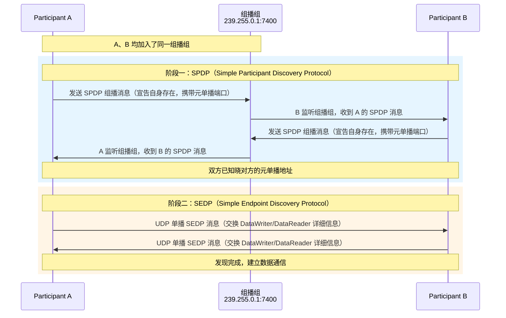
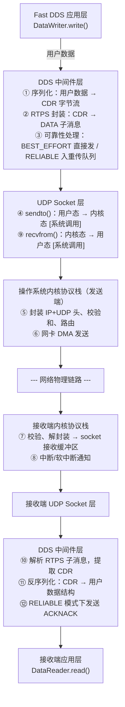
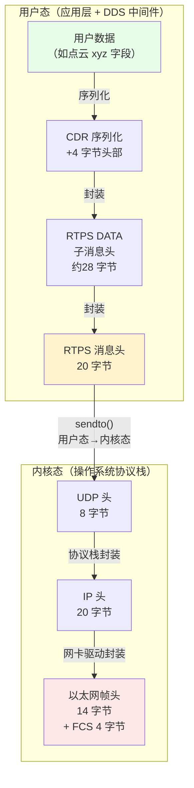
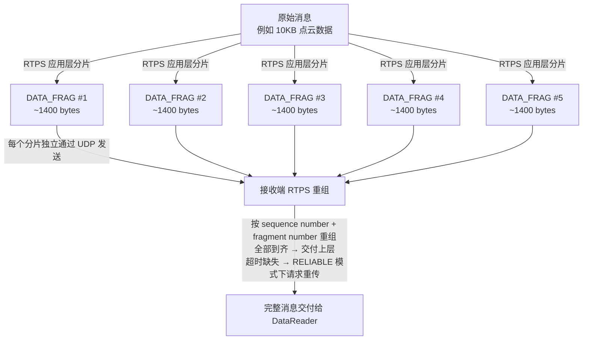
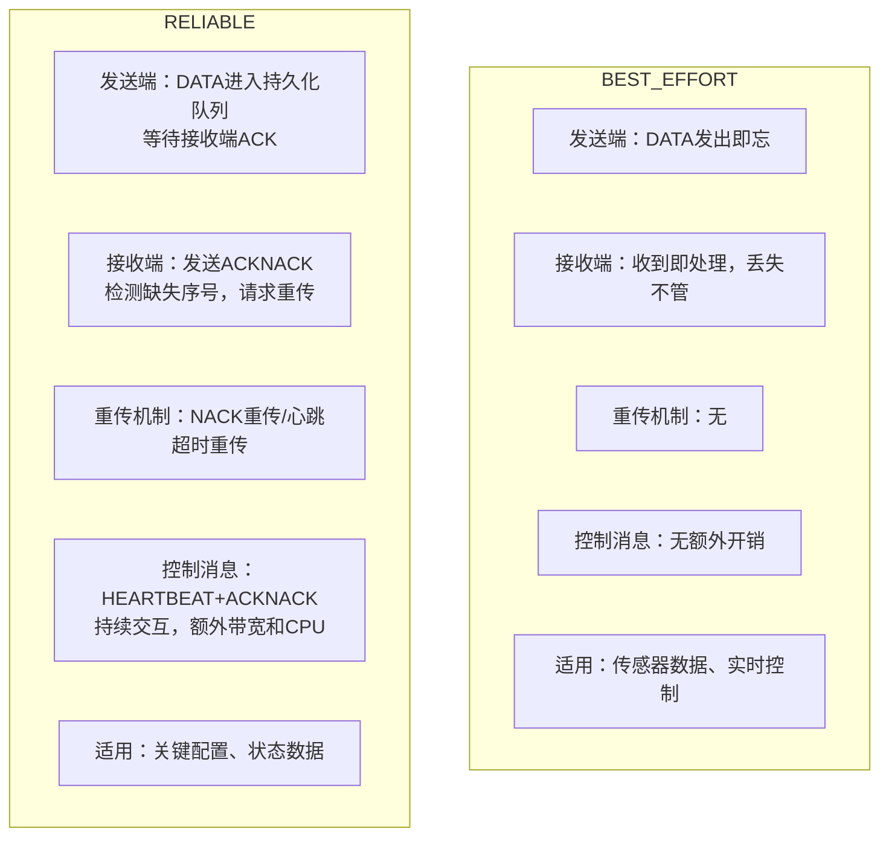
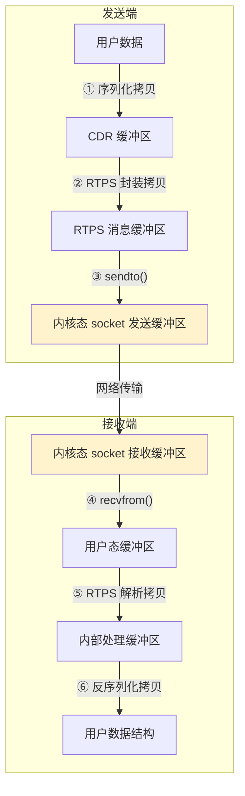
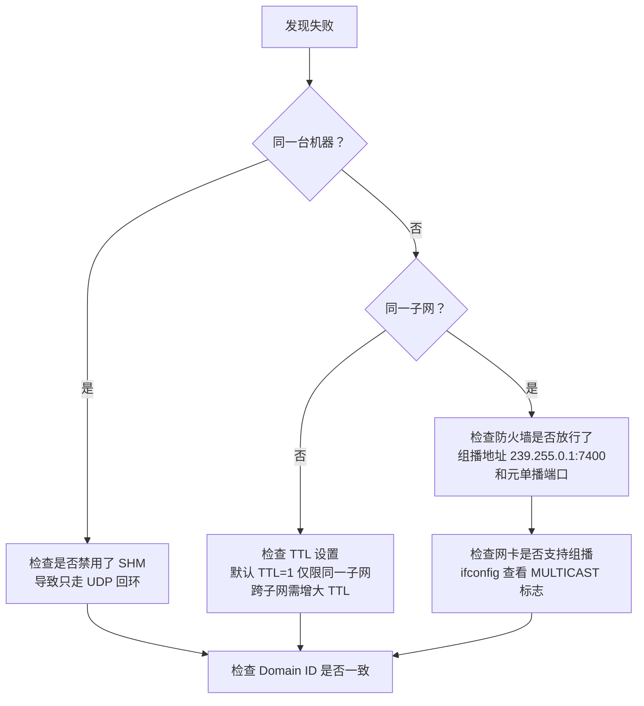
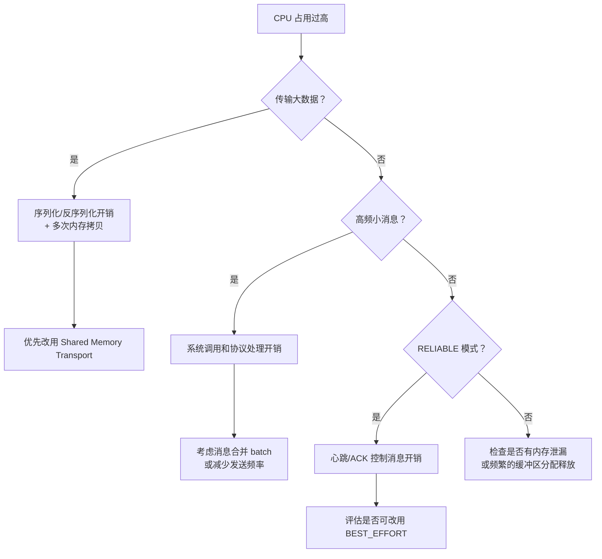
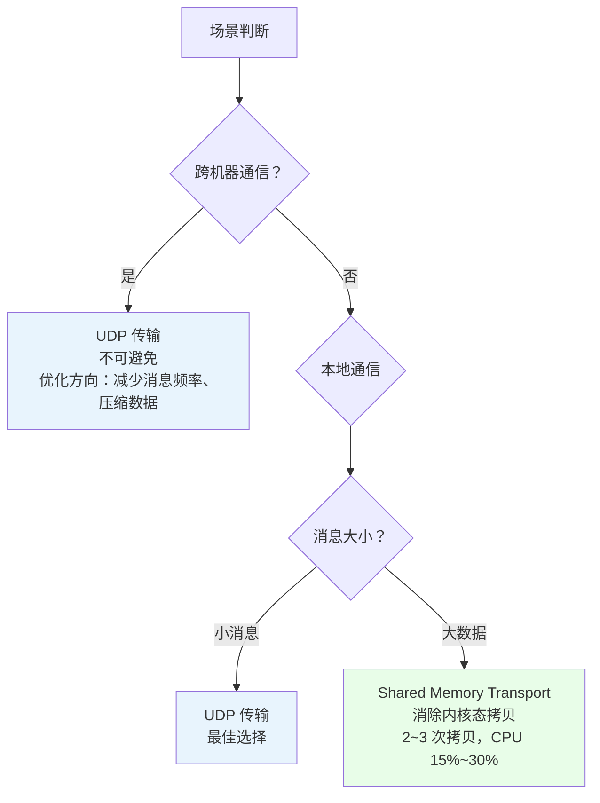

Fast DDS 的分层结构中，传输层是两个进程之间通信的桥梁。Fast DDS 默认支持多种传输方式：

| 标识符                | 值   | 传输类型                                                     |
| --------------------- | ---- | ------------------------------------------------------------ |
| LOCATOR_KIND_RESERVED | 0    | 保留给内部使用                                               |
| LOCATOR_KIND_UDPv4    | 1    | [UDP 传输（IPv4）](https://fast-dds.docs.eprosima.com/en/latest/fastdds/transport/udp/udp.html#transport-udp-udp) |
| LOCATOR_KIND_UDPv6    | 2    | [UDP 传输（IPv6）](https://fast-dds.docs.eprosima.com/en/latest/fastdds/transport/udp/udp.html#transport-udp-udp) |
| LOCATOR_KIND_TCPv4    | 4    | [TCP 传输（IPv4）](https://fast-dds.docs.eprosima.com/en/latest/fastdds/transport/tcp/tcp.html#transport-tcp-tcp) |
| LOCATOR_KIND_TCPv6    | 8    | [TCP 传输（IPv6）](https://fast-dds.docs.eprosima.com/en/latest/fastdds/transport/tcp/tcp.html#transport-tcp-tcp) |
| LOCATOR_KIND_SHM      | 16   | [共享内存传输](https://fast-dds.docs.eprosima.com/en/latest/fastdds/transport/shared_memory/shared_memory.html#transport-sharedmemory-sharedmemory) |

其中，**UDP 传输是 Fast DDS 最核心、最常用的传输方式**——它既是数据通信的默认通道，也是参与者发现（Participant Discovery）的唯一手段。本文将围绕 UDP 传输的通信流程、性能瓶颈、CPU 高占用原因、优缺点及适用场景展开分析。

### 文档导航

| 章节 | 内容 | 适合谁看 |
| ---- | ---- | -------- |
| [1. 完整流程](#1-udp-传输的完整流程) | 发现→分发→封装→分片→可靠性，全链路 Mermaid 流程图 | 初次了解 Fast DDS UDP 传输 |
| [2. 性能瓶颈分析](#2-性能瓶颈与-cpu-高占用分析) | 内存拷贝 4~6 次、CPU 归因、与 TCP/SHM 对比 | 排查性能问题、理解 CPU 高原因 |
| [3. 优缺点](#3-udp-传输的优缺点) | 优点/缺点/适用场景推荐度 | 选型决策 |
| [4. 调优参数](#4-fast-dds-udp-常见调优参数) | Socket 缓冲区、分片、非阻塞、TTL、内核参数、带宽估算 | 实际项目调优 |
| [5. 问题排查](#5-常见问题排查) | 发现失败、丢包、CPU 高排查流程 + 监控命令速查 | 线上问题定位 |
| [6. 实战案例](#6-实战案例点云数据传输优化) | 128 线雷达点云 2MB/帧优化全过程 | 大数据传输场景参考 |
| [7. 总结](#7-总结) | 场景决策树 | 快速查阅 |

---

## 1. UDP 传输的完整流程

UDP 传输在 Fast DDS 中承担两类职责：**参与者发现**（控制面）和**数据分发**（数据面）。理解这两条路径是掌握 UDP 传输全貌的前提。

### 1.1 参与者发现流程（Discovery）

Fast DDS 基于 RTPS 协议进行参与者发现，**完全依赖 UDP 组播**。流程如下：



关键要点：

| 阶段 | 协议 | 方式 | 说明 |
| ---- | ---- | ---- | ---- |
| **SPDP** | RTPS over UDP 组播 | 组播到 `239.255.0.1:7400` | 每个 Participant 周期性广播自身存在，携带元单播地址 |
| **SEDP** | RTPS over UDP 单播 | 单播到对方元单播端口 | 交换具体的 DataWriter / DataReader 信息 |
| **端口计算** | — | 确定性算法 | 元单播端口和用户数据端口由 Participant ID 确定性计算得出，无需额外协商 |

> **为什么必须用 UDP？** 因为参与者发现需要"一对多"的组播能力——每个 Participant 需要被同一域内的所有其他 Participant 发现，而 TCP 是点对点协议，无法实现组播发现。

### 1.2 数据分发流程（Data Distribution）

发现完成后，实际的数据传输走用户数据端口。一次完整的数据分发流程如下：



### 1.3 协议封装结构（Packet Encapsulation）

理解一个 UDP 数据包从用户数据到物理网络的层层封装过程，有助于直观认识协议开销的来源：



以一个 **100 字节用户数据** 为例，各层开销如下：

| 层级 | 头部大小 | 累计载荷 | 头部占比 |
| ---- | -------- | -------- | -------- |
| 用户数据 | 0 | 100 B | 0% |
| CDR 序列化 | 4 B | 104 B | 3.8% |
| RTPS DATA 子消息 | ~28 B | 132 B | 17.6% |
| RTPS 消息头 | 20 B | 152 B | 24.6% |
| UDP 头 | 8 B | 160 B | 27.5% |
| IP 头 | 20 B | 180 B | 30.6% |
| 以太网帧 | 18 B | 198 B | **33.3%** |

> **关键洞察**：即使对于 100 字节的小消息，协议头部开销也达到了 **98 字节（约 33%）**。消息越小，头部占比越高，带宽利用率越低。这也是为什么高频小消息场景下，适当合并消息（batching）可以有效提升吞吐量。

### 1.4 大数据分片流程（Fragmentation）

当消息体积超过 UDP MTU（以太网通常 1500 字节，UDP 有效载荷约 **1472 字节**）时，RTPS 协议会在应用层进行分片，避免依赖 IP 层分片（IP 分片丢失会导致整个包丢失）：



> **注意**：分片重组是 CPU 密集型操作。10KB 的消息需要拆成约 7 个分片，接收端需要维护重组缓冲区、检测完整性、处理乱序到达。消息越大，分片越多，CPU 开销越大。

### 1.5 可靠性机制（RELIABLE vs BEST_EFFORT）

RTPS 协议在 UDP 之上提供两种可靠性 QoS：



> **RELIABLE 模式的代价**：心跳（HEARTBEAT）和确认（ACKNACK）消息本身占用带宽和 CPU；发送端需要维护每个接收端的确认状态窗口；超时重传逻辑增加了延迟的不确定性。

---

## 2. 性能瓶颈与 CPU 高占用分析

### 2.1 内存拷贝——最核心的瓶颈

一次完整的 UDP 数据传输，端到端涉及 **4~6 次内存拷贝**，这是 CPU 高占用的首要原因：



**为什么拷贝这么耗 CPU？** 因为每次拷贝都需要 CPU 实际搬运数据。以 10MB 的点云为例，6 次拷贝意味着 CPU 实际搬运了 **60MB** 数据。频率越高、数据越大，CPU 越不堪重负。

### 2.2 CPU 高占用的完整归因

| 开销来源 | 详细说明 | 影响程度 |
| -------- | -------- | -------- |
| **序列化/反序列化** | CDR 编码/解码需遍历整个数据结构，大消息（点云、图像）时开销巨大 | ⭐⭐⭐⭐⭐ |
| **用户态 ↔ 内核态拷贝** | `sendto()` / `recvfrom()` 触发上下文切换 + 数据搬运，数据量越大越明显 | ⭐⭐⭐⭐⭐ |
| **RTPS 协议处理** | 每个包需构造/解析 RTPS 子消息，维护 Writer/Reader 状态机、序列号管理 | ⭐⭐⭐⭐ |
| **可靠性维护** | RELIABLE 模式下的 ACK 状态、超时重传、心跳窗口管理 | ⭐⭐⭐⭐ |
| **数据分片/重组** | 超过 MTU 的消息需分片发送和接收端重组，大消息时尤为严重 | ⭐⭐⭐ |
| **中断与软中断** | 高吞吐场景下网络中断、NAPI poll 等占用大量 CPU 时间 | ⭐⭐⭐ |
| **内存分配/释放** | 频繁的消息缓冲区分配和释放，尤其在非预分配场景下 | ⭐⭐ |

**一句话总结：CPU 高的根本原因是数据在多个层级之间反复拷贝，加上协议处理的计算开销。** 数据量越大、频率越高，CPU 压力越大。

### 2.3 与 TCP / 共享内存的对比

| 维度 | UDP 传输 | TCP 传输 | 共享内存 (SHM Transport) |
| ---- | -------- | -------- | -------------- |
| 内存拷贝次数 | 4~6 次 | 4~6 次（更多协议开销） | 2~3 次（消除内核态拷贝） |
| 系统调用 | sendto/recvfrom | send/recv（更多） | 无（纯用户态操作） |
| 序列化开销 | 有 | 有 | 仍需 CDR 序列化 |
| 协议开销 | RTPS + UDP 头 | RTPS + TCP 头 + 拥塞控制 | RTPS + SHM 元数据 |
| 跨机器 | 支持 | 支持 | 不支持 |
| 典型 CPU 占用 | 高 | 更高 | 较低（15%~30%） |

> 当传输大数据（点云、图像）且为本地进程间通信时，**Shared Memory Transport 是解决 CPU 高问题的首选方案**——它通过共享内存段传递 Buffer Descriptor，消除了内核态拷贝和系统调用，将拷贝次数从 4~6 次降低到 2~3 次。如需进一步降至 0 次拷贝，可结合 Data-sharing + loan API 实现 Zero-Copy。详见 [Shared Memory Transport](./Shared%20Memory%20Transport.md) 和 [Zero-Copy communication](./Zero-Copy%20communication.md)。

---

## 3. UDP 传输的优缺点

### 3.1 优点

| 优点 | 说明 |
| ---- | ---- |
| **无连接、低延迟** | 不需要像 TCP 那样三次握手建连，数据即发即走，适合实时性要求高的场景 |
| **支持组播/广播** | 天然支持一对多通信，Fast DDS 的参与者发现完全依赖 UDP 组播，这是 TCP 无法替代的 |
| **协议开销小** | UDP 头部仅 8 字节（TCP 至少 20 字节），有效载荷占比更高 |
| **实现简单** | 无需维护连接状态、拥塞控制、流量控制，中间件层实现相对轻量 |
| **广泛适用** | 几乎所有操作系统和网络设备都支持，跨网络、跨平台兼容性好 |
| **小消息高频场景最优** | 传感器数据、控制指令等小消息高频传输时，UDP 的轻量级特性发挥最大价值 |

### 3.2 缺点

| 缺点 | 说明 |
| ---- | ---- |
| **不可靠** | UDP 本身不保证送达、不保证顺序、不保证不重复，可靠性需 RTPS 在应用层补偿 |
| **大数据量性能差** | 多次内存拷贝 + 协议处理导致 CPU 占用高、吞吐量受限，不适合点云/图像等大数据 |
| **受 MTU 限制** | 单包受 MTU 限制（~1472 字节有效载荷），大数据需分片，分片丢失导致重组失败 |
| **无拥塞控制** | 高吞吐时可能导致网络拥塞和丢包，RTPS 流控不如 TCP 拥塞控制成熟 |
| **内核态拷贝不可避免** | 标准 UDP 必须在用户态和内核态之间拷贝数据，无法做到真正的零拷贝 |
| **排序和去重开销** | UDP 不保证顺序，RTPS 层需维护序列号进行排序和去重，增加接收端负担 |

### 3.3 适用场景

| 场景 | 推荐度 | 说明 |
| ---- | ------ | ---- |
| 小消息高频通信（传感器、控制指令） | ⭐⭐⭐⭐⭐ | UDP 的最佳场景，延迟低、开销小 |
| 跨机器/跨网络通信 | ⭐⭐⭐⭐⭐ | UDP 是网络通信的基础，不可替代 |
| 参与者发现（组播） | ⭐⭐⭐⭐⭐ | Fast DDS 依赖 UDP 组播进行 Participant Discovery |
| 大数据传输（点云、图像） | ⭐⭐ | 性能瓶颈明显，本地场景建议改用共享内存 |
| 本地进程间通信 | ⭐ | 应优先使用 Shared Memory Transport |
| 需要严格可靠性的场景 | ⭐⭐⭐ | 可用 RTPS RELIABLE 模式，但 CPU 和带宽开销较大 |

---

## 4. Fast DDS UDP 常见调优参数

当 UDP 传输出现性能瓶颈时，可以通过以下参数进行调优：

### 4.1 Socket 缓冲区大小

Socket 缓冲区是内核态为每个 UDP Socket 分配的收发缓冲区，直接影响吞吐量和抗丢包能力：

| 参数 | 默认值 | 建议值（大数据场景） | 说明 |
| ---- | ------ | -------------------- | ---- |
| `socket_send_buffer_size` | 系统默认（通常 48~256 KB） | 2~8 MB | 发送缓冲区过小会导致高吞吐时丢包 |
| `socket_receive_buffer_size` | 系统默认（通常 48~256 KB） | 2~8 MB | 接收缓冲区过小会导致内核来不及读取而丢包 |

```xml
<!-- 示例：通过 XML 配置增大 Socket 缓冲区 -->
<transport_descriptor>
    <transport_id>my_udp_transport</transport_id>
    <type>UDPv4</type>
    <sendBufferSize>4194304</sendBufferSize>    <!-- 4 MB -->
    <receiveBufferSize>4194304</receiveBufferSize> <!-- 4 MB -->
</transport_descriptor>
```

```cpp
// 示例：通过 C++ API 配置 UDP 传输
#include <fastdds/rtps/transport/UDPv4TransportDescriptor.h>
#include <fastdds/rtps/transport/shared_memory/SharedMemTransportDescriptor.h>

using namespace eprosima::fastdds::rtps;

// 1. 配置 UDP 传输
auto udp_transport = std::make_shared<UDPv4TransportDescriptor>();
udp_transport->sendBufferSize = 4 * 1024 * 1024;    // 4 MB
udp_transport->receiveBufferSize = 4 * 1024 * 1024;  // 4 MB
udp_transport->non_blocking_send = true;              // 非阻塞发送
udp_transport->TTL = 1;                               // 组播 TTL（1=同子网）

// 2. 注册传输（可同时注册 SHM 和 UDP）
DomainParticipantQos pqos;
pqos.transport().use_builtin_transports = false;      // 禁用默认传输

TransportDescriptorList transports;
transports.push_back(udp_transport);

// 如果需要本地高性能传输，同时注册 SHM
auto shm_transport = std::make_shared<SharedMemTransportDescriptor>();
transports.push_back(shm_transport);

pqos.transport().user_transports = transports;

// 3. 创建 Participant
DomainParticipant* participant =
    DomainParticipantFactory::get_instance()->create_participant(0, pqos);
```

> **注意**：Linux 系统有全局上限 `net.core.rmem_max` / `net.core.wmem_max`，需要先通过 `sysctl` 调大，否则设置不生效。

### 4.2 分片大小（maxMessageSize）

| 参数 | 默认值 | 说明 |
| ---- | ------ | ---- |
| `maxMessageSize` | 65500 字节 | RTPS 层单个消息的最大大小，超过此值会进行 RTPS 分片 |
| `sendBufferSize`（传输层） | 与 socket 缓冲区关联 | 影响单次 `sendto()` 的最大数据量 |

- **小消息高频场景**：保持默认即可，无需调整
- **大数据场景**：适当增大 `maxMessageSize` 可以减少分片数量，降低接收端重组开销；但要权衡 MTU 限制和网络丢包概率

### 4.3 非阻塞模式（non_blocking_send）

| 参数 | 默认值 | 说明 |
| ---- | ------ | ---- |
| `non_blocking_send` | false | 设为 true 时，`sendto()` 不会阻塞，避免发送慢拖慢应用线程 |

- **开启后**：发送操作变为非阻塞，消息可能被丢弃但不会阻塞应用线程，适合对延迟敏感但允许少量丢失的场景
- **关闭时**：发送操作会阻塞直到数据写入内核缓冲区，保证不丢但可能影响应用实时性

### 4.4 组播 TTL（TTL）

| 参数 | 默认值 | 说明 |
| ---- | ------ | ---- |
| `TTL` | 1 | 组播消息的生存时间，控制组播范围 |

| TTL 值 | 范围 | 适用场景 |
| ------ | ---- | -------- |
| 0 | 仅限本机 | 本机测试 |
| 1 | 同一子网（默认） | 局域网内通信，最常用 |
| 2~32 | 同一站点 | 跨子网但同一组织内 |
| 32+ | 更大范围 | 广域网（慎用，可能影响网络性能） |

### 4.5 操作系统级内核参数调优

除了 Fast DDS 自身的参数，操作系统层面的内核参数同样对 UDP 性能有显著影响：

| 内核参数 | 默认值 | 建议值 | 说明 |
| -------- | ------ | ------ | ---- |
| `net.core.rmem_max` | 212 KB | 4~16 MB | Socket 接收缓冲区的全局上限，必须调大才能让 Fast DDS 的大缓冲区配置生效 |
| `net.core.wmem_max` | 212 KB | 4~16 MB | Socket 发送缓冲区的全局上限 |
| `net.core.netdev_max_backlog` | 1000 | 5000~10000 | 网卡接收队列长度，高吞吐时防止内核丢包 |
| `net.core.netdev_budget` | 300 | 600~1000 | 每次软中断处理的最大包数，提高中断处理效率 |
| `net.ipv4.udp_mem` | 自动 | 根据内存调整 | UDP 协议栈的全局内存限制（页为单位） |

```bash
# 临时生效（重启后失效）
sudo sysctl -w net.core.rmem_max=16777216
sudo sysctl -w net.core.wmem_max=16777216
sudo sysctl -w net.core.netdev_max_backlog=10000
sudo sysctl -w net.core.netdev_budget=600

# 永久生效（写入配置文件）
echo "net.core.rmem_max=16777216" >> /etc/sysctl.conf
echo "net.core.wmem_max=16777216" >> /etc/sysctl.conf
echo "net.core.netdev_max_backlog=10000" >> /etc/sysctl.conf
echo "net.core.netdev_budget=600" >> /etc/sysctl.conf
sudo sysctl -p
```

> **经验法则**：先调操作系统参数，再调 Fast DDS 参数。如果 `rmem_max` 没有调大，即使在 Fast DDS 中配置了 `receiveBufferSize=4MB`，实际生效的仍然是系统默认值。

### 4.6 带宽估算公式速查

在规划 UDP 传输参数前，先估算实际带宽需求：

```
单主题带宽 = 消息大小 × 频率 × (1 + 协议头部开销比)
```

| 参数 | 典型值 | 说明 |
| ---- | ------ | ---- |
| 协议头部开销 | ~98 字节（小消息） | CDR(4) + RTPS DATA(~28) + RTPS Header(20) + UDP(8) + IP(20) + ETH(18) |
| 头部开销比 | 小消息(~33%) ~ 大消息(~5%) | 消息越大，头部占比越低 |
| RTPS 分片数 | ⌈消息大小 / 1400⌉ | 每个分片独立占用一个 UDP 包 |

**速算示例**：

| 场景 | 消息大小 | 频率 | 原始带宽 | 含开销带宽 | 包率 |
| ---- | -------- | ---- | -------- | ---------- | ---- |
| 传感器小消息 | 100 B | 1000 Hz | 800 Kbps | ~1.1 Mbps | 1000 pps |
| 中尺寸点云 | 50 KB | 10 Hz | 4 Mbps | ~4.5 Mbps | ~360 pps |
| 大尺寸点云 | 2 MB | 10 Hz | 160 Mbps | ~168 Mbps | ~14300 pps |
| 图像（压缩） | 500 KB | 30 Hz | 120 Mbps | ~126 Mbps | ~10700 pps |

> **经验法则**：千兆以太网理论带宽 1000 Mbps，实际可用约 700~800 Mbps。当估算带宽超过物理链路的 70% 时，应考虑压缩数据、降低频率或升级网络。

### 4.7 调优速查表

| 问题现象 | 优先调整参数 | 辅助手段 |
| -------- | ------------ | -------- |
| 高吞吐时丢包 | 增大 socket 收发缓冲区 | 检查网络带宽、开启非阻塞发送 |
| CPU 占用过高 | 减少分片（调大 MTU） | 改用 BEST_EFFORT、减少消息频率 |
| 延迟不稳定 | 关闭 RELIABLE 改 BEST_EFFORT | 减小消息体积、开启非阻塞发送 |
| 发现不了远端 Participant | 检查 TTL、防火墙规则 | 确认组播地址和端口未被占用 |
| 大数据传输帧率低 | 改用 Shared Memory Transport | 增大 socket 缓冲区 + 分片大小 |

---

## 5. 常见问题排查

### 5.1 参与者发现失败

**现象**：两个 Participant 运行在同一网络，但互相发现不了。

排查步骤：



### 5.2 高吞吐场景丢包

**现象**：发送端正常发送，但接收端数据不完整，帧率低于预期。

| 排查方向 | 检查方法 | 解决方案 |
| -------- | -------- | -------- |
| **Socket 接收缓冲区溢出** | `netstat -su \| grep "receive buffer errors"` | 增大 `socket_receive_buffer_size` |
| **内核 backlog 溢出** | `netstat -su \| grep "overflows"` | 增大 `net.core.netdev_max_backlog` |
| **网络带宽饱和** | `iperf3` 测试实际带宽 | 降低消息频率或压缩数据 |
| **交换机/路由器丢包** | 检查交换机端口统计 | 启用流控或升级网络设备 |
| **RTPS 分片丢失** | 开启 Fast DDS 日志 verbose 级别 | 增大分片间隔或改用 RELIABLE 模式 |

### 5.3 CPU 占用过高

**现象**：UDP 传输时 CPU 占用率持续偏高，影响系统其他任务。



### 5.4 性能监控与诊断命令速查

| 命令 | 用途 | 示例 |
| ---- | ---- | ---- |
| `netstat -su` | 查看 UDP 统计信息（丢包、缓冲区错误） | `netstat -su \| grep "receive buffer errors"` |
| `ss -su` | 更高效的 socket 统计（替代 netstat） | `ss -su` 查看 UDP socket 汇总 |
| `ss -u -l` | 查看 UDP 监听端口 | `ss -u -l` 确认组播监听是否正常 |
| `iperf3 -u` | UDP 带宽/丢包率测试 | `iperf3 -c <server_ip> -u -b 100M -t 30` |
| `tcpdump` | 抓包分析 RTPS/UDP 报文 | `tcpdump -i eth0 -w cap.pcap udp port 7400` |
| `wireshark` | 图形化分析 RTPS 协议 | 过滤 `rtps` 查看发现/通信消息 |
| `cat /proc/net/udp` | 查看 UDP socket 队列状态 | 关注 `tx_queue` / `rx_queue` 是否积压 |
| `sar -n DEV 1` | 实时监控网卡流量 | 观察是否接近链路带宽上限 |
| `ethtool -S eth0` | 查看网卡硬件统计（丢包、错误） | 关注 `rx_dropped`、`tx_dropped` |
| `sysctl net.core` | 查看当前内核网络参数 | `sysctl net.core.rmem_max` 确认缓冲区上限 |

> **快速诊断流程**：先用 `netstat -su` 看有没有丢包 → 用 `iperf3 -u` 测实际带宽 → 用 `tcpdump` 抓包确认包率 → 用 `sar` 监控是否带宽饱和。

---

## 6. 实战案例：点云数据传输优化

以一个典型的机器人点云传输场景为例，演示如何将前面各章节的知识串联起来：

### 场景描述

- **数据**：128 线激光雷达点云，每帧约 **2 MB**
- **频率**：10 Hz（每 100ms 一帧）
- **通信方式**：两台工控机之间通过千兆以太网传输
- **初始问题**：帧率只能达到 3~4 Hz，CPU 占用 60%+

### 第一步：定位瓶颈

根据本文第 2 章的分析，2 MB 的消息通过 UDP 传输时：

```
2 MB 消息 → RTPS 分片 → 约 1430 个 UDP 包（每包 ~1400 字节）
每帧 1430 个包 × 10 Hz = 14300 包/秒
```

- 内存拷贝：6 次 × 2 MB = **12 MB/帧**，10 Hz 时 CPU 搬运 **120 MB/s**
- 分片重组：每帧 1430 个分片，接收端重组开销巨大
- 系统调用：至少 14300 次 `sendto()` + 14300 次 `recvfrom()` = 28600 次/秒

### 第二步：逐步优化

| 优化措施 | 操作 | 效果 |
| -------- | ---- | ---- |
| **增大 Socket 缓冲区** | `rmem_max`/`wmem_max` 调至 16 MB，Fast DDS 缓冲区设为 8 MB | 减少内核丢包，帧率从 3~4 Hz 提升到 5~6 Hz |
| **调大内核 backlog** | `netdev_max_backlog` 从 1000 调至 10000 | 减少高并发时的队列溢出丢包 |
| **关闭 RELIABLE 改 BEST_EFFORT** | 点云允许少量丢失，不需要重传 | 省去 HEARTBEAT/ACKNACK 开销，CPU 降低 ~15% |
| **开启非阻塞发送** | `non_blocking_send = true` | 避免发送阻塞应用线程，延迟更稳定 |

### 第三步：评估是否足够

经过上述优化后，帧率提升到了 7~8 Hz，CPU 降到 35%。但仍然达不到 10 Hz 的目标。

**根本原因**：2 MB 的消息通过 UDP 传输，6 次内存拷贝是不可避免的，这是架构层面的限制。

### 第四步：架构级优化

| 方案 | 适用条件 | 预期效果 |
| ---- | -------- | -------- |
| **改用 Shared Memory Transport** | 两台工控机在同一台物理机上（或可合并为一台） | 帧率达到 10 Hz+，CPU 降至 15%~30%（仅 SHM Transport）；进一步开启 Zero-Copy 可降至 5% 以下 |
| **点云降采样** | 允许降低点云密度 | 减小消息体积，从根本上减少拷贝量和分片数 |
| **自定义序列化** | 替换 CDR 为更紧凑的格式 | 减少序列化开销，但开发成本较高 |
| **UDP + 网卡多队列** | 硬件支持 RSS 的网卡 | 分散中断负载到多个 CPU 核心 |

> **关键教训**：UDP 传输大数据时，参数调优只能缓解症状，不能根治问题。当数据量超过一定阈值，必须从架构层面解决——要么改用共享内存，要么减小数据量。

---

## 7. 总结

UDP 传输是 Fast DDS 的基石——**发现靠它、通信靠它**。它在小消息高频和跨网络场景中表现优异，但在大数据量场景下面临严峻的性能挑战。核心瓶颈在于 **4~6 次内存拷贝** 和 **RTPS 协议处理开销**，这两者共同导致了 CPU 高占用。

优化路径：



> 下一篇：[Shared Memory Transport](./Shared%20Memory%20Transport.md) —— 如何通过共享内存规避 UDP 传输的性能瓶颈。
>
> 参考链接：[Fast DDS UDP Transport 官方文档](https://fast-dds.docs.eprosima.com/en/latest/fastdds/transport/udp/udp.html)
