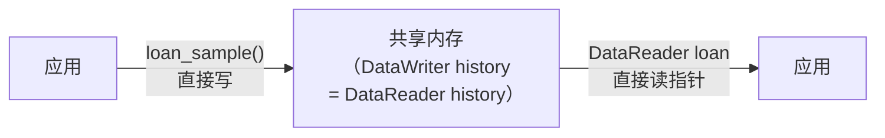
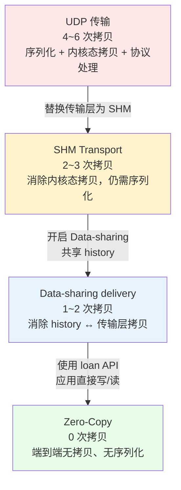
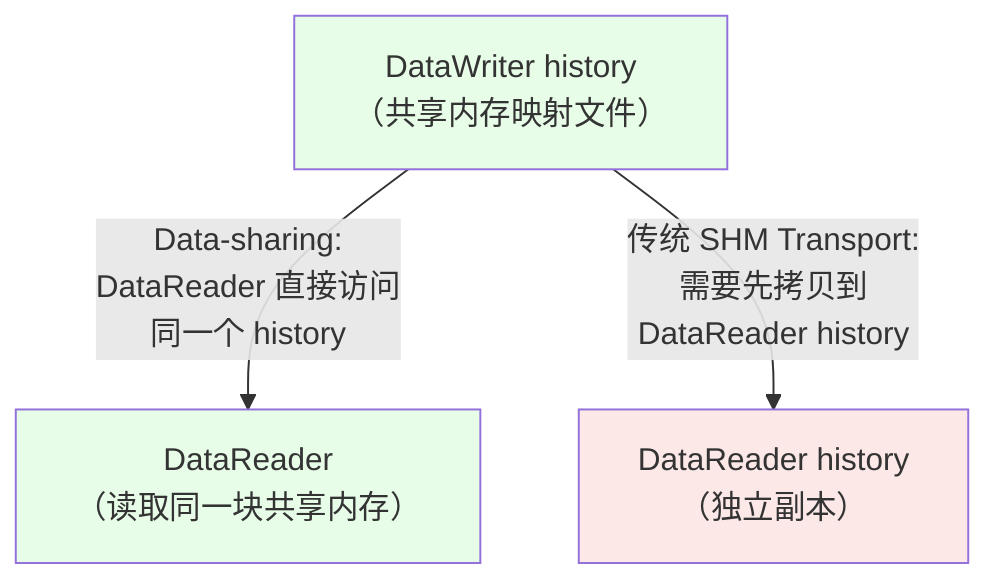
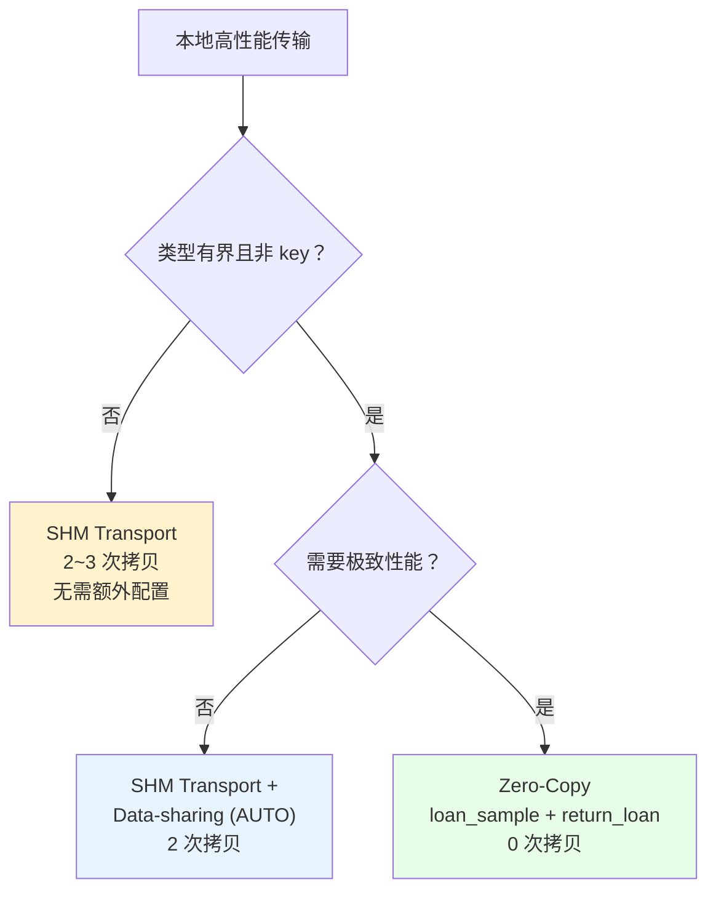

Fast DDS 提供了多种本地高性能传输机制，很多人会将它们混为一谈。本文的核心目标是**厘清三个概念的区别与联系**，并详细说明如何实现真正的端到端零拷贝。

### 文档导航

| 章节 | 内容 | 适合谁看 |
| ---- | ---- | -------- |
| [1. 三层概念辨析](#1-三层概念辨析shm-transport--data-sharing--zero-copy) | SHM Transport / Data-sharing / Zero-Copy 的本质区别 | 面试准备、概念澄清 |
| [2. Data-sharing delivery](#2-data-sharing-delivery-原理) | 共享 history 机制、配置方法、约束条件 | 理解中间层机制 |
| [3. Zero-Copy 实现](#3-zero-copy-端到端零拷贝) | loan API 使用方法、完整代码示例 | 实际项目接入 |
| [4. 性能对比](#4-性能对比三种机制横向对比) | UDP / SHM / Data-sharing / Zero-Copy 全维度对比 | 选型决策 |
| [5. 约束与局限](#5-约束条件与局限性) | 类型约束、QoS 约束、常见坑 | 避坑指南 |
| [6. 总结](#6-总结) | 决策树 + 速查表 | 快速回顾 |

---

## 1. 三层概念辨析：SHM Transport / Data-sharing / Zero-Copy

Fast DDS 官方文档中，这三个概念分别位于不同章节，解决不同层次的问题：

| 概念 | 官方文档位置 | 层次 | 解决什么问题 |
| ---- | ------------ | ---- | ------------ |
| **Shared Memory Transport** | [6.4 传输层](https://fast-dds.docs.eprosima.com/en/latest/fastdds/transport/shared_memory/shared_memory.html) | 传输层 | 用共享内存替代 UDP 网络传输，消除**内核态拷贝** |
| **Data-sharing delivery** | [6.5 QoS 层](https://fast-dds.docs.eprosima.com/en/latest/fastdds/transport/datasharing.html) | DataWriter ↔ DataReader | 直接共享 DataWriter 的 history 给 DataReader，消除 **history ↔ 传输层** 之间的拷贝 |
| **Zero-Copy communication** | [15.9 应用层](https://fast-dds.docs.eprosima.com/en/latest/fastdds/use_cases/zero_copy/zero_copy.html) | 应用 ↔ 应用 | 通过 loan API 让应用直接写/读共享内存，实现**端到端 0 次拷贝** |

官方文档明确指出它们的区别：

> Although Data-sharing delivery uses shared memory, it differs from Shared Memory Transport in that Shared Memory is a full-compliant transport. That means that with Shared Memory Transport the data being transmitted must be **copied from the DataWriter history to the transport and from the transport to the DataReader**. With Data-sharing these copies can be avoided.
>
> — [Fast DDS 官方文档 6.5](https://fast-dds.docs.eprosima.com/en/latest/fastdds/transport/datasharing.html)

### 1.1 数据流对比

三种机制的数据流对比，可以直观看出每一步消除了哪些拷贝：

**UDP 传输（4~6 次拷贝）**：


**SHM Transport（2~3 次拷贝）**：


**Zero-Copy（0 次拷贝）**：



### 1.2 递进关系

三者是**递进关系**，每一层在前一层基础上进一步消除开销：



> **一句话总结**：SHM Transport 消除的是传输层的内核态拷贝；Data-sharing 消除的是 history 与传输层之间的拷贝；Zero-Copy 消除的是应用与 DDS 中间件之间的拷贝。三者叠加，才能实现真正的端到端零拷贝。

---

## 2. Data-sharing delivery 原理

Data-sharing delivery 是 Zero-Copy 的基础。理解它的工作机制，才能理解 Zero-Copy 为什么能实现零拷贝。

### 2.1 核心机制

Data-sharing delivery 的核心思想是：**DataWriter 和 DataReader 直接共享同一块共享内存中的 history**。



| 维度 | 传统 SHM Transport | Data-sharing delivery |
| ---- | ------------------ | --------------------- |
| history 归属 | DataWriter 和 DataReader 各有独立的 history | DataReader 直接访问 DataWriter 的 history |
| 传输层参与 | 数据需从 DataWriter history → 传输层 → DataReader history | 跳过传输层，DataReader 直接读取 |
| 拷贝次数 | 2~3 次 | 1~2 次（应用↔history 仍有拷贝） |

### 2.2 工作流程

1. **预分配**：DataWriter 创建时，Fast DDS 在共享内存映射文件中预分配 `max_samples + extra_samples` 个样本的缓冲区池
2. **写入**：DataWriter 发布数据时，从池中取出一个样本缓冲区，填入数据，加入 history
3. **通知**：DataReader 被通知有新数据可用（通过共享内存中的通知机制）
4. **读取**：DataReader 直接访问 DataWriter history 中的共享内存数据

### 2.3 约束条件

Data-sharing delivery 仅在满足以下所有条件时可用：

| 约束 | 说明 |
| ---- | ---- |
| 同一台机器 | DataWriter 和 DataReader 必须能访问同一块共享内存 |
| 有界类型 | TopicDataType 必须是有界的（`is_bounded()` 返回 true） |
| 非 key 类型 | Topic 不能包含 key 字段 |
| 内存模式 | DataWriter 必须使用 `PREALLOCATED_MEMORY_MODE` 或 `PREALLOCATED_WITH_REALLOC_MEMORY_MODE` |
| 无安全插件 | 不能使用 DDS Security 插件 |
| History depth | DataReader 的 history depth 不能超过 DataWriter 的 |

### 2.4 配置方法

```cpp
// DataWriter 端配置
DataWriterQos wqos;
wqos.data_sharing().on("shared_directory");  // 开启 Data-sharing
// 或
wqos.data_sharing().automatic();              // AUTO 模式（自动判断是否可用）

// DataReader 端配置
DataReaderQos rqos;
rqos.data_sharing().on("shared_directory");  // 开启 Data-sharing
// 或
rqos.data_sharing().automatic();              // AUTO 模式
```

`DataSharingQosPolicy` 有三种模式：

| 模式 | 说明 |
| ---- | ---- |
| `ON` | 强制开启 Data-sharing。如果不满足约束条件，匹配会失败 |
| `AUTO` | 自动判断：满足约束条件时开启，否则回退到普通模式 |
| `OFF` | 强制关闭 Data-sharing |

> **建议**：使用 `AUTO` 模式，让 Fast DDS 自动判断。强制 `ON` 可能在约束不满足时导致匹配失败。

---

## 3. Zero-Copy 端到端零拷贝

Zero-Copy 在 Data-sharing delivery 的基础上，通过 **loan API** 让应用直接写/读共享内存，消除应用与 history 之间的最后一层拷贝。

### 3.1 核心 API

| API | 作用 | 调用方 |
| --- | ---- | ------ |
| `DataWriter::loan_sample(void*& sample)` | 从 DataWriter 的共享内存池中借出一个缓冲区，应用直接在其中写入数据 | 发送端 |
| `DataWriter::write(void* sample)` | 将借出的缓冲区发布出去。调用后，缓冲区所有权归还给中间件 | 发送端 |
| `DataWriter::discard_loan(void*& sample)` | 丢弃已借出但未写入的缓冲区。如果 `loan_sample()` 成功但决定不 `write()`，必须调用此函数归还缓冲区 | 发送端 |
| `DataReader::take(next_sample, info)` | 获取接收到的样本（以 loan 方式，返回指向共享内存的指针） | 接收端 |
| `DataReader::return_loan(collection, info)` | 归还借出的样本，释放共享内存缓冲区 | 接收端 |

### 3.2 完整代码示例

#### IDL 类型定义

Zero-Copy 要求类型必须是 **有界（bounded）** 且 **非 key** 的，并使用 `@extensibility(FINAL)` 修饰：

```idl
@extensibility(FINAL)
struct LoanablePointCloud
{
    unsigned long timestamp;
    unsigned long point_count;
    float x[65536];    // 固定大小数组（有界）
    float y[65536];
    float z[65536];
};
```

#### DataWriter 端

```cpp
#include <fastdds/dds/domain/DomainParticipant.hpp>
#include <fastdds/dds/publisher/DataWriter.hpp>
#include <fastdds/dds/publisher/qos/DataWriterQos.hpp>

// 创建 Participant 和 Publisher（省略 Topic 创建代码）
// ...

// 关键：配置 Data-sharing 为 AUTO 或 ON
DataWriterQos wqos = publisher->get_default_datawriter_qos();
wqos.history().depth = 10;
wqos.durability().kind = TRANSIENT_LOCAL_DURABILITY_QOS;
wqos.data_sharing().automatic();  // 开启 Data-sharing

DataWriter* writer = publisher->create_datawriter(topic, wqos);

// Zero-Copy 发送流程
void* sample = nullptr;
if (RETCODE_OK == writer->loan_sample(sample))
{
    // 此时 sample 指向共享内存中的缓冲区
    // 直接在其中写入数据，无需任何拷贝
    LoanablePointCloud* data = static_cast<LoanablePointCloud*>(sample);
    data->timestamp() = get_current_timestamp();
    data->point_count() = 65536;
    fill_point_data(data->x(), data->y(), data->z());

    // 发布数据。调用后，缓冲区所有权归还中间件
    writer->write(sample);
}
```

#### DataReader 端

```cpp
// 关键：配置 Data-sharing 为 AUTO 或 ON
DataReaderQos rqos = subscriber->get_default_datareader_qos();
rqos.history().depth = 10;
rqos.reliability().kind = RELIABLE_RELIABILITY_QOS;
rqos.durability().kind = TRANSIENT_LOCAL_DURABILITY_QOS;
rqos.data_sharing().automatic();  // 开启 Data-sharing

DataReader* reader = subscriber->create_datareader(topic, rqos, &listener);

// Zero-Copy 接收流程（在 on_data_available 回调中）
void on_data_available(DataReader* reader)
{
    LoanableCollection<LoanablePointCloud> data;
    SampleInfoSeq infos;

    // 以 loan 方式读取数据
    // data 中的样本直接指向共享内存，无拷贝
    while (RETCODE_OK == reader->take(data, infos))
    {
        for (int i = 0; i < data.length(); ++i)
        {
            if (infos[i].valid_data)
            {
                // 直接访问共享内存中的数据
                const LoanablePointCloud& point = data[i];

                // 检查样本是否被覆盖（Data-sharing 的 history 耦合机制）
                // 如果 DataWriter 复用了同一个缓冲区，样本可能已失效
                bool valid = reader->is_sample_valid(&point, &infos[i]);
                if (valid)
                {
                    process_point_cloud(point.timestamp(), point.point_count(),
                                        point.x(), point.y(), point.z());
                }
            }
        }

        // 必须归还 loan！否则共享内存缓冲区不会释放
        reader->return_loan(data, infos);
    }
}
```

### 3.3 Data-sharing 的 history 耦合机制

使用 Data-sharing delivery 时，DataReader 直接访问 DataWriter 的 history，两者之间存在**强耦合**：

| 行为 | 说明 |
| ---- | ---- |
| **样本复用** | DataWriter 复用同一个缓冲区发布新数据时，DataReader 将失去对旧数据的访问权 |
| **确认机制** | 样本在 DataReader 应用首次访问（read/take）后才算“已确认”，之后 DataWriter 才能复用该样本 |
| **阻塞保护** | 如果池中所有样本都未被确认，DataWriter 的 write 操作会被阻塞，直到有样本可用或达到 `max_blocking_time` |
| **extra_samples** | 配置 `extra_samples` 可以增加池中的缓冲区数量，降低阻塞概率 |

> 这意味着 Data-sharing 不是简单的“发布即忘”，DataWriter 和 DataReader 的行为是相互影响的。在设计系统时，需要确保 DataReader 的处理速度能够跟上 DataWriter 的发布速度。

### 3.4 关键注意事项

| 要点 | 说明 |
| ---- | ---- |
| **loan_sample 后必须 write 或 discard_loan** | 借出缓冲区后必须调用 `write()` 归还所有权，或调用 `discard_loan()` 释放缓冲区，否则缓冲区泄漏 |
| **take 后必须 return_loan** | 读取后必须调用 `return_loan()` 释放缓冲区，否则共享内存池耗尽 |
| **take 后应检查 is_sample_valid** | Data-sharing 下样本可能被 DataWriter 复用，需验证样本是否仍然有效 |
| **write 后不能再修改数据** | `write()` 调用后，缓冲区所有权归中间件，应用不应再修改 |
| **return_loan 后不能再访问数据** | 归还后缓冲区可能被回收或覆盖 |
| **类型必须有界** | 不能使用 `std::string`、`std::vector` 等动态类型，必须用固定大小数组 |

---

## 4. 性能对比：三种机制横向对比

以 128 线激光雷达点云（约 2 MB/帧，10 Hz）为例：

| 维度 | UDP | SHM Transport | Data-sharing | Zero-Copy |
| ---- | --- | ------------- | ------------ | --------- |
| **拷贝次数** | 4~6 次 | 2~3 次 | 2 次 | **0 次** |
| **序列化** | CDR 全量 | CDR 全量 | CDR 全量 | **跳过** |
| **系统调用** | sendto/recvfrom | 无 | 无 | 无 |
| **CPU 占用** | 60%+ | 15%~30% | 10%~20% | **3%~5%** |
| **端到端延迟** | 2~5 ms | 0.5~1 ms | 0.3~0.8 ms | **0.1~0.5 ms** |
| **配置复杂度** | 默认即可 | 默认启用 | 需配置 QoS + 有界类型 | 需配置 QoS + loan API |
| **跨机器** | 支持 | 不支持 | 不支持 | 不支持 |

> **结论**：Zero-Copy 是 Fast DDS 本地传输的性能天花板。但它的配置约束较多（有界类型、非 key、PREALLOCATED 内存模式），需要权衡开发成本和性能收益。

---

## 5. 约束条件与局限性

### 5.1 类型约束

| 约束 | 原因 | 替代方案 |
| ---- | ---- | -------- |
| 必须有界（bounded） | 共享内存需要预分配固定大小的缓冲区 | 使用固定大小数组替代 `std::vector`，用 `char[N]` 替代 `std::string` |
| 不能是 key 类型 | Data-sharing 不支持 key 过滤 | 将 key 字段拆分为单独的 Topic |
| `@extensibility(FINAL)` | 保证内存布局固定，可安全共享 | 不能使用 `APPENDABLE` 或 `MUTABLE` |

### 5.2 QoS 约束

| 约束 | 说明 |
| ---- | ---- |
| 内存模式 | 必须使用 `PREALLOCATED_MEMORY_MODE` 或 `PREALLOCATED_WITH_REALLOC_MEMORY_MODE` |
| History depth | DataReader 的 depth 不能超过 DataWriter 的 |
| Durability | 建议搭配 `TRANSIENT_LOCAL`，确保 late-joining 的 DataReader 能获取历史数据 |
| Security | Data-sharing 不兼容 DDS Security 插件 |

### 5.3 常见坑

| 问题 | 原因 | 解决 |
| ---- | ---- | ---- |
| Data-sharing 未生效 | 类型不满足约束（如使用了 `std::string`） | 改用固定大小类型，开启 `AUTO` 模式让 Fast DDS 自动判断 |
| `loan_sample()` 返回错误 | Data-sharing 未启用，或共享内存池已满 | 检查 `DataSharingQosPolicy` 配置，增大 `max_samples` |
| 共享内存泄漏 | `return_loan()` 未调用 | 确保每条路径（包括异常路径）都调用 `return_loan()` |
| 匹配失败 | `DataSharingQosPolicy` 设为 `ON` 但约束不满足 | 改为 `AUTO` 模式 |

---

## 6. 总结



**速查表**：

| 要点 | SHM Transport | Data-sharing | Zero-Copy |
| ---- | ------------- | ------------ | --------- |
| 拷贝次数 | 2~3 次 | 2 次 | 0 次 |
| 序列化 | 需要 | 需要 | 跳过 |
| 配置 | 默认启用 | `DataSharingQosPolicy` | loan API + Data-sharing |
| 类型约束 | 无 | 有界、非 key | 有界、非 key、FINAL |
| 适用场景 | 通用本地传输 | 本地大数据优化 | 本地大数据极致性能 |

> 前置阅读：[UDP Transport](./UDP%20Transport.md) —— UDP 传输的完整流程与性能瓶颈分析。
>
> 前置阅读：[Shared Memory Transport](./Shared%20Memory%20Transport.md) —— SHM 传输的实现原理与使用方法。
>
> 参考链接：
> - [Fast DDS Data-sharing delivery](https://fast-dds.docs.eprosima.com/en/latest/fastdds/transport/datasharing.html)
> - [Fast DDS Zero-Copy communication](https://fast-dds.docs.eprosima.com/en/latest/fastdds/use_cases/zero_copy/zero_copy.html)
> - [Fast DDS Shared Memory Transport](https://fast-dds.docs.eprosima.com/en/latest/fastdds/transport/shared_memory/shared_memory.html)
